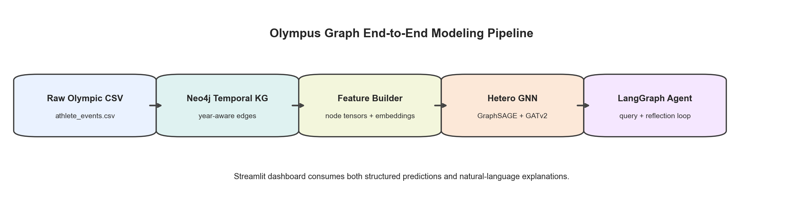
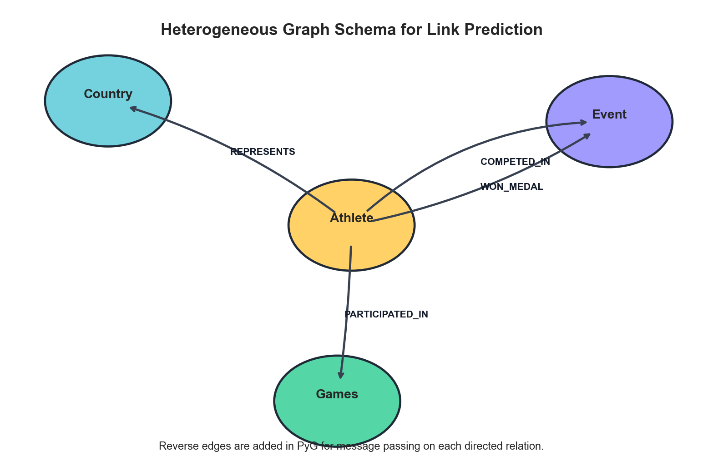
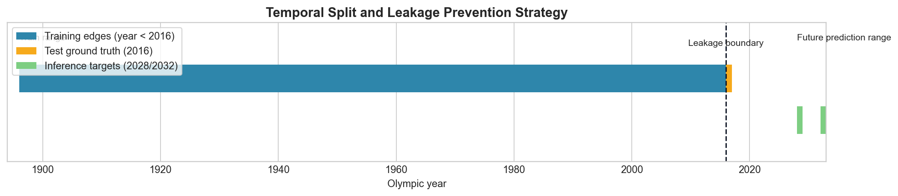
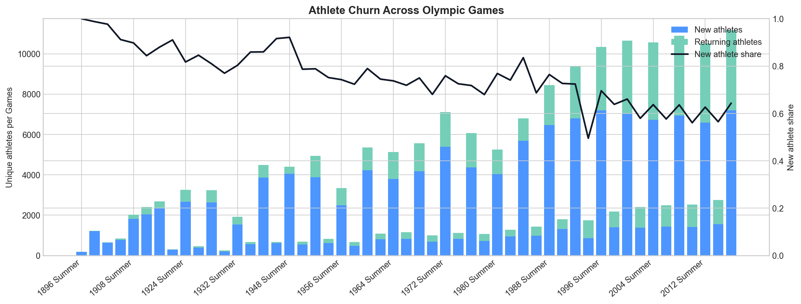
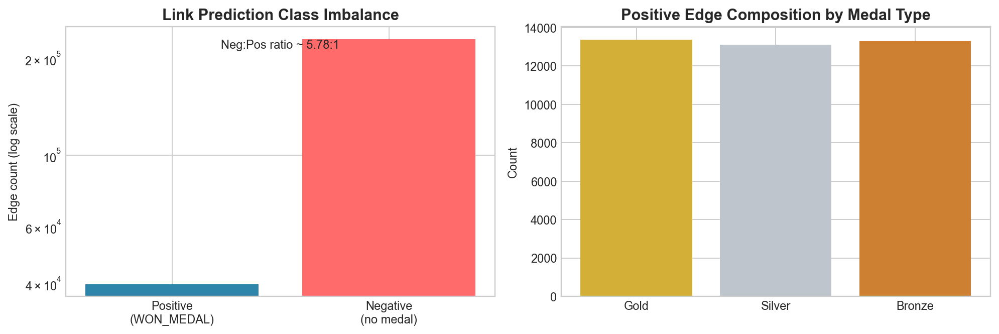
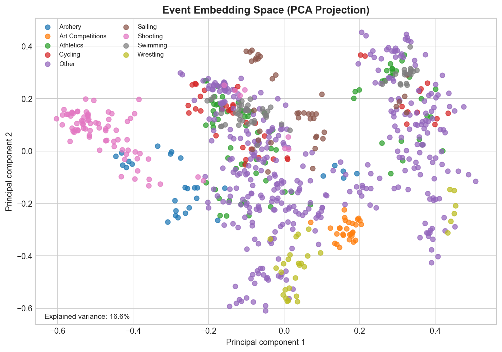
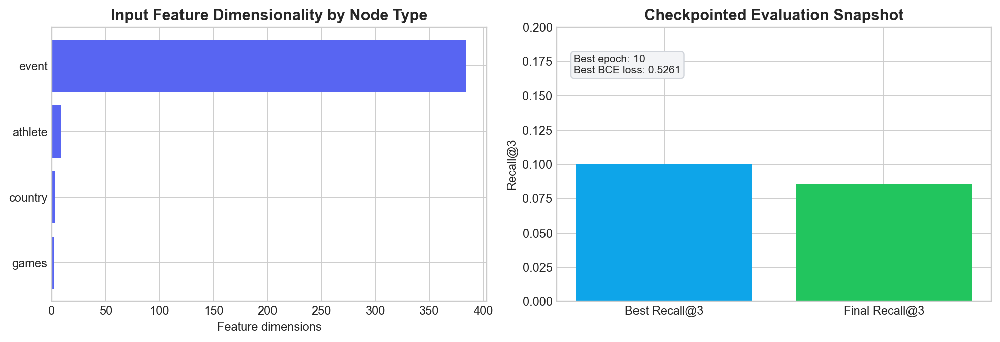

# Olympus Graph

A neuro-symbolic Olympic medal prediction system that combines:
- a temporal Neo4j knowledge graph,
- a heterogeneous GNN for medal link prediction, and
- a LangGraph agent for natural-language querying and explanation.

## Why this project is different

- **Temporal leakage control by design**: training snapshots only include edges with `year < target_year`.
- **Heterogeneous relational modeling**: athlete, country, event, and games nodes are learned jointly.
- **Hard-negative training**: negatives are sampled from real `COMPETED_IN` pairs without medals, not only random pairs.
- **Neuro-symbolic interface**: structured GNN predictions are paired with tool-using LLM reasoning.

## End-to-end system



## Graph schema used by the model



Node types:
- `Athlete`
- `Country`
- `Event`
- `Games`

Core edge types:
- `(:Athlete)-[:PARTICIPATED_IN {year, age, performance}]->(:Games)`
- `(:Athlete)-[:REPRESENTS]->(:Country)`
- `(:Athlete)-[:COMPETED_IN {year}]->(:Event)`
- `(:Athlete)-[:WON_MEDAL {year, medal}]->(:Event)`

## How data is fit into the model

### 1. Ingestion

`src/graph/ingest.py` loads `data/raw/athlete_events.csv`, cleans fields, builds IDs, and writes nodes/edges to Neo4j.

### 2. Feature engineering

`src/graph/preprocess.py` creates:
- event text embeddings (`all-MiniLM-L6-v2`, 384 dims),
- country GDP/population/host features,
- exported feature parquet files for training snapshots.

### 3. Tensorization

`src/model/dataset.py` converts snapshot queries into PyG `HeteroData`.

Feature blocks:
- `athlete`: 9 features (performance history, participation, bio, recency)
- `country`: 3 features (gdp, population, host flag)
- `event`: 384-dim sentence embedding
- `games`: 2 features (year, season)

### 4. GNN modeling

`src/model/gnn.py`:
- node-type encoders per entity type,
- multi-layer hetero message passing (GraphSAGE + final GATv2 layer),
- residual connections,
- link decoder MLP on concatenated `(athlete_emb, event_emb)`.

### 5. Objective and evaluation

`src/model/train.py` + `src/model/evaluate.py`:
- binary cross-entropy on positive `WON_MEDAL` edges vs sampled negatives,
- periodic Recall@K evaluation,
- main metric: **Recall@3 on Gold medalists**.

## Temporal split strategy

Defaults from `src/config.py`:
- train years: **1896-2015** (`TRAIN_YEARS`)
- holdout test year: **2016** (`TEST_YEAR`)



## ML and data diagnostics

### Athlete churn dynamics

This chart shows roster turnover per Games (new vs returning athletes), which is useful for understanding distribution shift and forecasting difficulty.



### Class imbalance in link prediction

This chart shows why negative sampling strategy matters in this problem.



### Event embedding geometry

PCA projection of event embeddings, showing semantic structure learned from event text.



### Model profile and checkpoint snapshot

Feature dimensionality and currently saved checkpoint evaluation snapshot.



## Current data/model snapshot (from local artifacts)

- Rows in cleaned dataset: **271,116**
- Unique athletes: **135,571**
- Unique events: **765**
- Countries (NOC): **230**
- Games editions: **51**
- Unique `COMPETED_IN` edges: **269,636**
- Unique `WON_MEDAL` edges: **39,751**
- Negative:positive competed/medal ratio: **~5.78:1**
- Saved best checkpoint (`best_model.pt`):
  - epoch: **10**
  - BCE loss: **0.5261**
  - Recall@3: **0.1005**
- Saved final checkpoint (`final_model.pt`) eval:
  - Recall@3: **0.0854**
  - hits/total: **17/199**

## Quick start

### Prerequisites

- Python 3.10+
- Neo4j (local Docker or AuraDB)
- API key for one LLM provider:
  - Groq (`GROQ_API_KEY`) or
  - OpenAI (`OPENAI_API_KEY`)

### Installation

```bash
cd olympus-graph
python3 -m venv .venv
source .venv/bin/activate
python -m pip install --upgrade pip
pip install -r requirements.txt
```

### Environment setup

```bash
cp .env.example .env
# then edit .env with Neo4j and LLM credentials
```

### Start Neo4j (local Docker)

```bash
docker run -d --name olympus-neo4j \
  -p 7474:7474 -p 7687:7687 \
  -e NEO4J_AUTH=neo4j/password \
  neo4j:5.26-community
```

### Data and training pipeline

```bash
# 1) ingest raw CSV into Neo4j
python -m src.graph.ingest

# 2) preprocess embeddings + country features
python -m src.graph.preprocess

# 3) train GNN
python -m src.model.train

# 4) run dashboard
streamlit run src/app/dashboard.py
```

### Optional quick smoke data

```bash
python -m src.graph.bootstrap_data
```

## Using the app

`src/app/dashboard.py` supports:
- historical graph queries (Cypher via agent),
- future prediction queries (GNN scoring),
- top-k ranked athletes with probabilities,
- interactive local athlete neighborhood graph.

Example prompts:
- `Who won the most Gold medals in Swimming?`
- `Who will win the Men's 100m in 2028?`
- `Show me Usain Bolt's Olympic history`

## Re-generate all README figures

```bash
python3 scripts/generate_readme_figures.py
```

Outputs go to `docs/figures/`.

## Repository layout

```text
olympus-graph/
├── data/
│   ├── raw/
│   └── processed/
├── docs/
│   └── figures/
├── scripts/
│   └── generate_readme_figures.py
├── src/
│   ├── graph/
│   ├── model/
│   ├── agent/
│   └── app/
└── README.md
```
